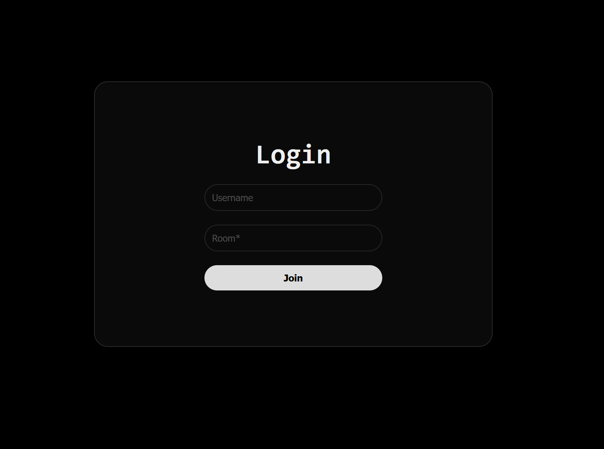
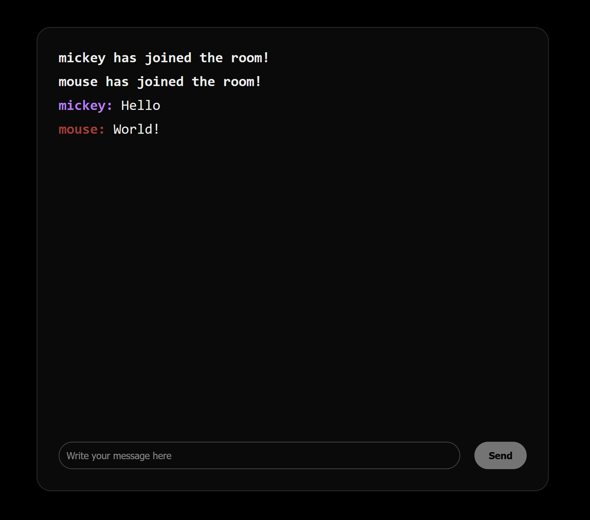

# Websocket Chatrooms

This is a simple websocket chatroom website I built using Bun and websockets. I made it during my time off from school to learn more about end to end encrytion and just as a way to entertain myself.

<div float="middle">
  
  
</div>

## Features

- **End-to-End Encryption**: Messages are encrypted before being sent and can only be decrypted by the recipients.
- **Real-Time Communication**: Using websockets for real time messaging.
- **Simple UI**: A (very) minimal and easy-to-use interface.

## Setup

### Prerequisites

- Make sure you have [bun](https://bun.sh/) installed of course.

### Getting Started

1. Clone the repository.
2. Make the certs/ folder to place your openssl https certificates in. (You can also modify the code slightly to make it basic HTTP)
3. Run the following commands inside a terminal in the folder:
```bash
bun install
```
```
bun start
```

## Contributions

Contributions are again very much welcome! Please fork the repository and create a pull request for any changes you'd like to make.
